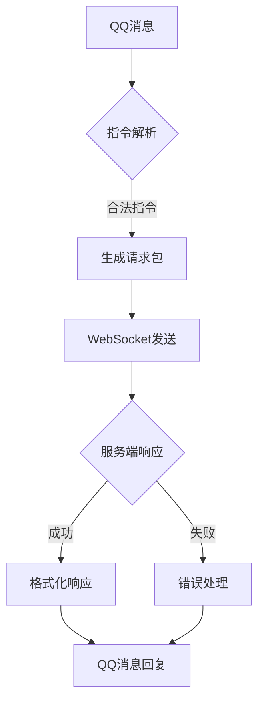

# HuHoBot 机器人客户端

[](https://www.python.org/)
[](https://opensource.org/licenses/GPL-3)

基于QQ官方Bot框架的Minecraft服务管理机器人，实现WebSocket协议的双向通信桥梁。

## 核心能力

### 功能特性
- **双向通信**：通过WebSocket与服务端保持长连接
- **权限管理**：多层级管理员系统
- **消息模板**：支持文本/图片混合消息格式
- **异步处理**：基于asyncio的事件循环模型
- **会话管理**：UUID匹配请求响应

### 主要功能
- 白名单添加/删除/查询
- 服务器状态监控
- 游戏内命令执行
- MOTD服务器状态查询
- 服务器绑定管理
- 自定义扩展指令

## 技术架构



## 快速入门

### 环境要求
- Python 3.9+
- 依赖库：`pip install -r requirements.txt`
- QQ开放平台应用

### 安装运行
```bash
# 克隆仓库
git clone https://github.com/HuHoBot/BotClient.git

# 安装依赖
pip install -r requirements.txt

# 启动机器人
python index.py
```

## 配置说明

### 核心配置
```env
# config.py
APPID = ""        # QQ机器人应用ID
SECRET = "" # QQ机器人应用密钥
AUDIT=True
```

### 服务监控
- 自动心跳检测（5秒间隔）
- 断线自动重连（3秒重试）
- 请求超时自动清理

## License
GPL-v3 License © 2025 HuHoBot

